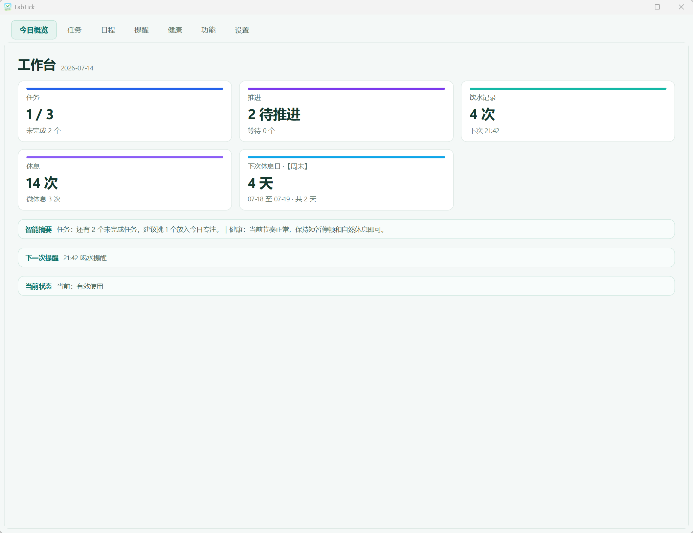
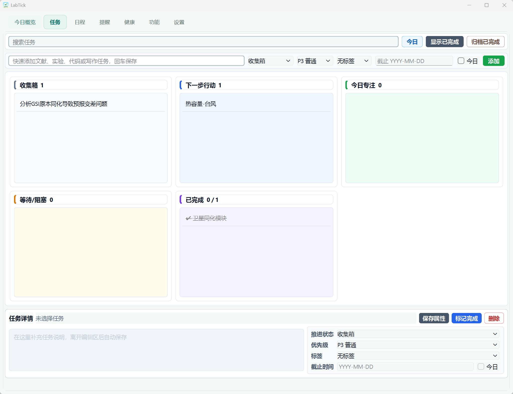
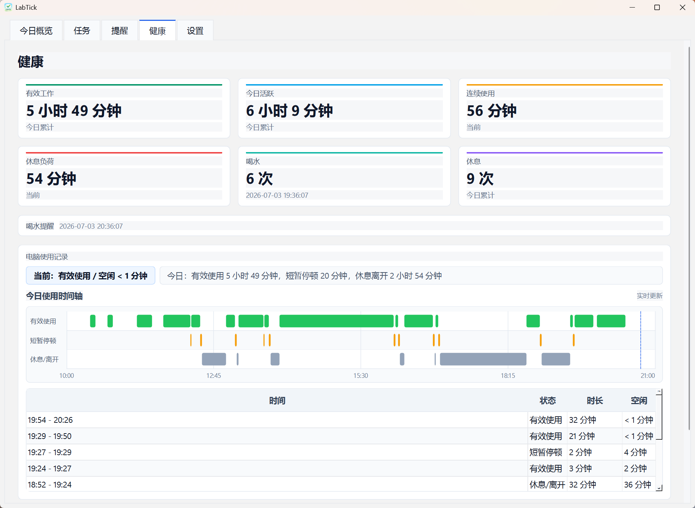
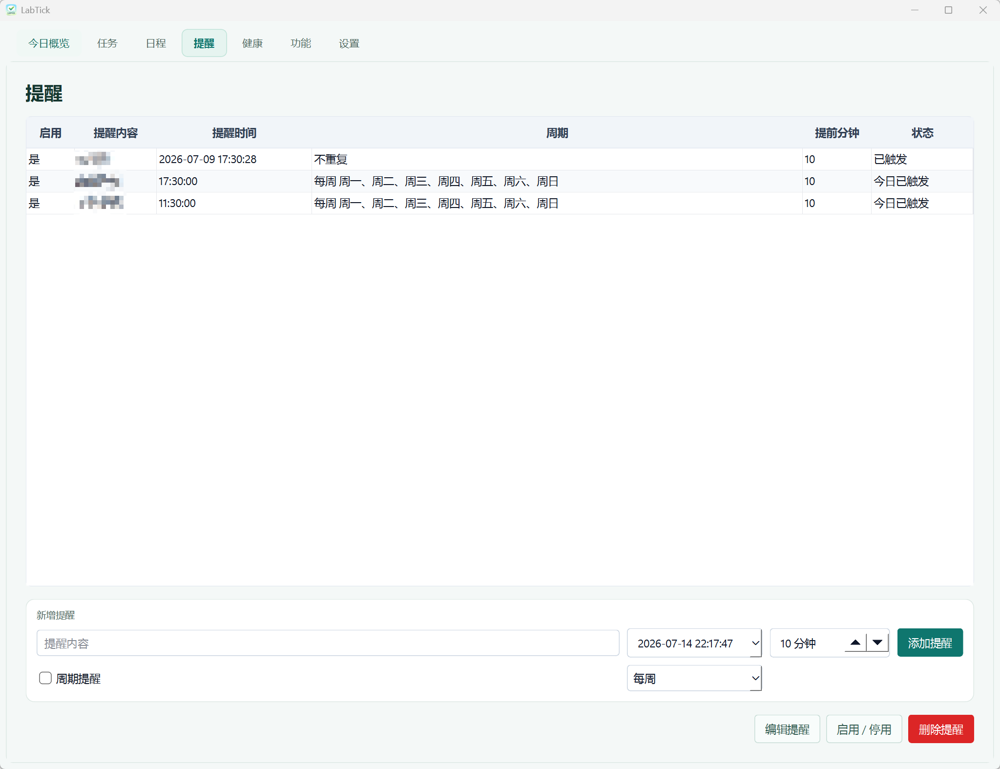
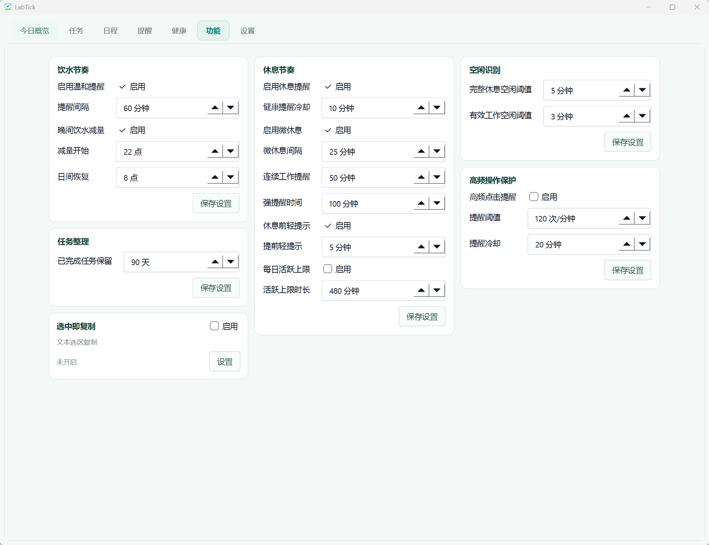
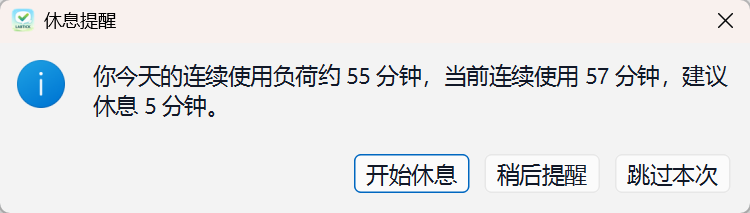

# Caday

Caday 是一款 Windows 免安装辅助工具，提供任务推进、日程与截稿管理、定时提醒、电脑使用统计、饮水提醒和休息节奏辅助。

## 界面预览

> 界面中的任务、时间和统计数字仅用于展示软件功能。

## 主要功能

- **今日概览**：集中显示任务进度、提醒和当天使用状态。
- **任务管理**：按收集箱、下一步行动、今日专注、等待/阻塞和已完成组织文献、实验、数据、代码、绘图与写作任务。
- **日程**：按月记录实验、会议、截稿和其他阶段安排，输入后自动保存。
- **提醒管理**：创建、暂停、启用和删除本地提醒。
- **健康提醒**：记录有效使用、短暂停顿和休息时间；提醒会避开离开电脑、全屏和专注时段，并支持 22 点后晚间饮水减量。
- **本地存储**：设置、任务、提醒和统计数据均保存在程序旁的 `data` 目录，不上传到云端。
- **节假日卡片**：每日获取当年及下一年的法定节假日和调休安排并保存在本地；断网时使用已有缓存。
- **更新检查**：可在设置中启用启动检查或手动检查 GitHub 最新版本；网络失败不影响正常使用。

> 健康功能用于辅助工作节奏，不替代医疗建议。晚间饮水减量是可配置的低打扰策略，不代表禁水；口渴、运动、炎热、发热或有基础疾病时应按实际情况和医嘱调整。

## 功能截图

### 任务管理

任务板按推进状态组织任务，支持搜索、今日筛选、标签、截止时间、详情编辑、完成和归档。

### 健康与使用统计

汇总有效工作、今日活跃、连续使用、休息负荷、喝水和休息次数，并用时间轴展示当天电脑使用状态。

### 提醒与参数设置

| 提醒管理 | 参数设置 |
| --- | --- |
|  |  |

### 喝水与休息提醒

| 喝水提醒 | 休息提醒 |
| --- | --- |
|  |  |

## 下载与使用

1. 进入 [Caday 最新版发布页](https://github.com/OAKun/Caday/releases/tag/latest)。
2. 下载 `Caday.exe`。
3. 将程序放在桌面、用户文档或其他具有写入权限的普通文件夹中。
4. 双击运行。

适用于 Windows 64 位环境，无需安装 Python 或其他运行库。

## 更新方法

1. 关闭正在运行的 Caday。
2. 使用新下载的 `Caday.exe` 覆盖旧文件。
3. 保留原有的 `data` 目录；任务、提醒和设置会继续沿用。

每次更新的具体内容请查看 [Caday Releases](https://github.com/OAKun/Caday/releases)。

> 不建议将程序放在可能需要管理员权限的 `Program Files` 目录，否则本地数据可能无法正常写入。
